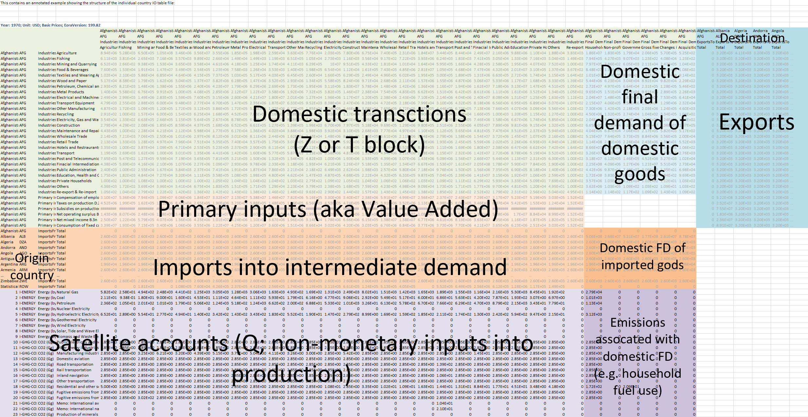
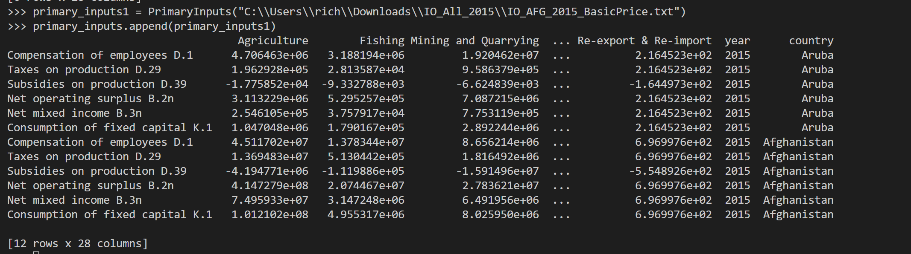

# Input Output Tables
Describes a reader interface for input-output tables for Eora data 

To leverage simply use a file downloaded from Eora.

Supports country tables only currently including:
- DomesticTransactions 
- PrimaryInputs

Currently supports only Domestic Transactions and can be used like so:

```
transactions = DomesticTransactions("C:\\Users\\rich\\Downloads\\IO_All_2015\\IO_ABW_2015_BasicPrice.txt")
transactions.get_dataset(extended = True)
transactions1 = DomesticTransactions("C:\\Users\\rich\\Downloads\\IO_All_2015\\IO_AFG_2015_BasicPrice.txt")
transactions.append(transactions1)
```

Which returns a pandas dataframe. Using extended = True will add year and country columns. In addition the append method will add additional country tables so that you can have an uber country pandas dataframe. Next versions of this will allow directories to be read and country table segments to be created from them.

Currently only supports country tables but will be extended to mrio at a later stage.

Country tables defined using the following schema.



Returns a pandas dataframe of a certain type like so (for PrimaryInputs):


